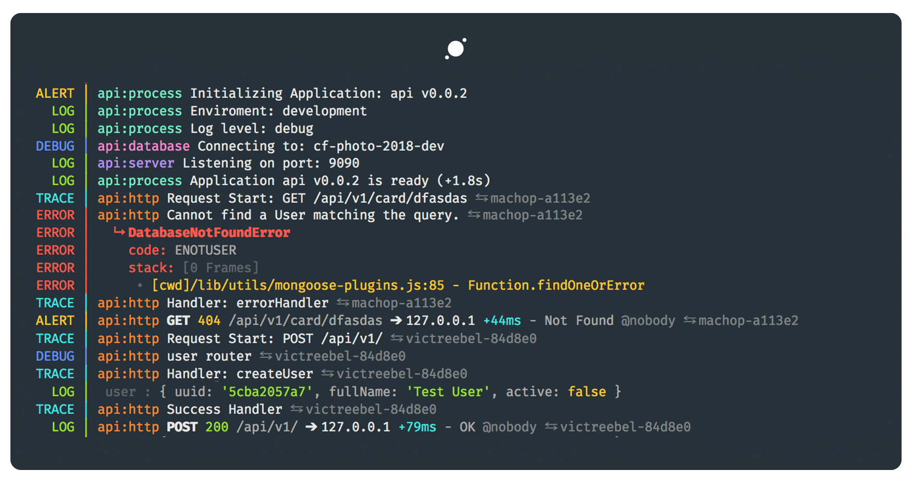
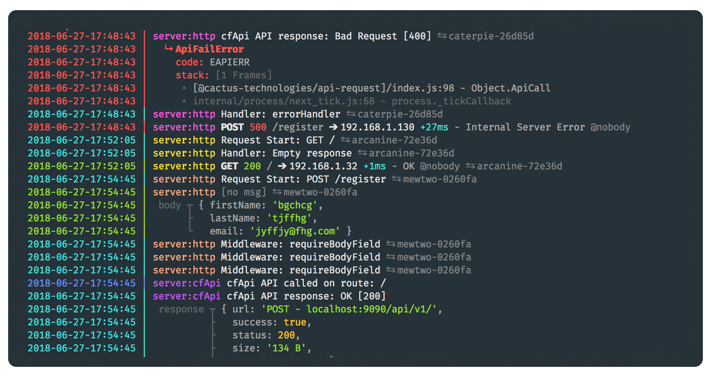

# pretty-pino



> Prettifies NDJSON (Newline Delimited JSON) logs. Similar to pino-pretty but actually pretty.

---

## Table of contents

-   [Installation](#installation)

-   [Usage](#usage)

    -   [Advanced Usage](#advanced-usage)

-   [Programatic Interface](#programatic-interface)

-   [Options](#options)

-   [Changelog](#changelog)

-   [License](#license)

## Installation

```sh
npm install pretty-pino --global
```

## Usage

The tool reads from the `STDIN` and is installed as the cmd `pretty` in the shell.

-   You can pipe it to the output of a running application:

    ```sh
    node index.js | pretty [OPTIONS]
    ```

-   Or just feed it an already existing file.

    ```sh
    pretty [OPTIONS] < input.log
    ```

### Advanced Usage

```txt
    pretty --help
    ___

    Usage: ... | pretty [options]

    Time Staps
    --time-stamps                   Print TimeStamps.                   [boolean][default: true]
    --stamps-format, -f             TimeStamps format.                  [YYYY-MM-DD-HH:mm:ss]
    --stamps-time-zone, --tz        TimeStamps zone offset.             [default: "Etc/UTC"]
    --print-host                    Prepends the host to the log line.  [boolean][default: false]

    Filter
    --strict                        Only show "legal" log lines.        [boolean][default: false]
    --level, -l                     Only show messages >= level.        [string][default: "trace"]

    Inspect
    --depth                         (passed to util.inspect)            [number][default: 4]
    --max-array-length              (passed to util.inspect)            [number][default: 100]

    Other
    --force-color                   Force color output                  [boolean][default: false]
```



Notes:

-   The`boolean` options can be set false using `--no-option`. Example: `--no-time-stamps`
-   The`--level` choices are: "trace", "debug", "info", "error", "warn", "fatal"
-   The`--stamps-format` value is passed directly to [`moment.format()`](https://momentjs.com/docs/#/displaying/format/)
-   You force the colored output using the env variable: `FORCE_COLOR=1`
-   You can pass the time stamps zone offset via the env variable: `PRETTY_TZ`
-   You can pass the time stamps format via the env variable: `PRETTY_STAMPS_FORMAT`

## Programatic Interface

Install `pretty-pino` alongside `pino` and set the `prettyPrint` option to `true`. Usefull on development.

You can pass options to `pretty-pino` using `pino`'s `prettyPrint` option. See the [Options](#Options) section for more info.

```js
const pino = require('pino')

const log = pino({
    prettyPrint: { forceColor: true },
    prettifier: require('pretty-pino')
})

log.info('hello world')
```

## Options

The options object passed to `pretty-pino` will merge with the default options.

```js
 {
    level: 'trace', // Only print messages >= level.
    strict: false, // Only print valid pino/bunyan logs

    forceColor: false // Force color output
    termColors: false, // trust the term colors, not the stream ones
    colorLevel: 2 // based on your terminal (uses supports-color)

    depth: 4, // (passed to util.inspect)
    maxArrayLength: 100, // (passed to util.inspect)

    printHost: false, // Print Host.
    timeStamps: true, // Print TimeStamps.
    stampsFormat: 'YYYY-MM-DD-HH:mm:ss',
    stampsTimeZone: moment.tz.guess(), // TimeStamps zone offset (Based on your Locale)
}
```

## Changelog

Find the CHANGELOG [here](CHANGELOG.md), generated using Conventional Commits.

## License

[MIT](LICENSE) © [Jorge Proaño](http://www.hidden-node-problem.com)
